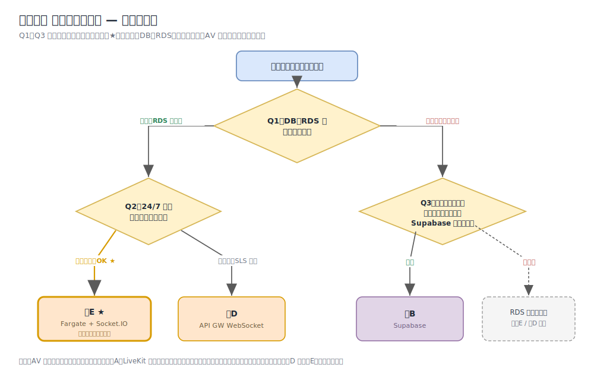

# チャット リアルタイム層 — 意思決定キット

> チームでアーキテクチャ（Supabase / 案D / 案E）を決めるための会議用キット。
> **プレリード → アジェンダ → 決定マトリクス → 決定ツリー** の順で、そのまま会議を回せる構成。
> 詳細比較は [`chat-realtime-architecture.md`](./chat-realtime-architecture.md)、PoC 所見は [`../CHAT_POC_FINDINGS.md`](../CHAT_POC_FINDINGS.md)。

---

## 0. この意思決定の性質（先に共有）

- **可逆性が高い（two-way door）**：チャット層は設計上 AV（LiveKit）から分離しているため、後から差し替え可能。→ **完璧を狙わず、要点を詰めて速く決める**。迷ったら短いスパイクで裏取り。
- **意思決定者を 1 人決める（DACI/RAPID）**：合議の多数決にしない。**Decider** が input を受けて最終決定。
- **個人採点 → すり合わせ**：会議前に各自が §3 のマトリクスを採点（アンカリング／声の大きい人バイアスを回避）。会議では割れた項目だけ議論。

---

## 1. プレリード（1 ページ要約／会議前に各自読む）

### 決めること
独立 Next.js 実査アプリ（Rails / ActionCable なし）の **チャット リアルタイム配信層**を 1 つ選ぶ。

### 確定している前提（議論しない）
- 永続化 = **AWS RDS（PostgreSQL）** ／ 添付 = **S3** ／ AV = **LiveKit（チャットと分離）**
- 認可はサーバー権威（PoC の `lib/livekit/chat.ts` の送受信マトリクスを移植）
- LiveKit データチャネルは「永続化なし・履歴なし」が確定（PoC 所見）→ 配信層を別に用意する必要がある

### 候補 3 案（1 行サマリ）
| 案 | 一行 | DB＝RDS との整合 |
|---|---|---|
| **案B Supabase** | realtime+DB+RLS+storage を 1 基盤に集約。実装最速・運用最小 | ✗（DB が Supabase Postgres になる） |
| **案D API GW WebSocket** | AWS サーバーレスで自前。常駐なし | ◎ |
| **案E Fargate + Socket.IO** | 常駐 Node で自前。ActionCable に最も近い | ◎ |

### 決め手の問い（これに答えれば決まる → §4 の図）
- **Q1：DB＝RDS は“確定制約”か、“見直し可”か？**（見直し可なら Supabase が再浮上）
- **Q2：24/7 常駐コンテナ（固定費・コンテナ運用）を許容できるか？**（許容＝案E／サーバーレス必須＝案D）

### 会議前の宿題
- §3 の決定マトリクスを **各自で採点**してくる（重みは仮、当日合意し直す）
- Q1・Q2 の自分の立場（はい/いいえ）と理由を 1 行ずつ用意

---

## 2. アジェンダ（タイムボックス 75 分）

| 時間 | 内容 | アウトプット |
|---|---|---|
| 0:00–0:05 | ゴールと可逆性の確認、**Decider** の明示 | 役割合意 |
| 0:05–0:15 | 前提の確認と **Q1/Q2** の立場表明（一人 1 行） | 分岐の論点が明確化 |
| 0:15–0:28 | 評価軸の**重み**をチームで合意（§3 の重み列を埋める） | 重み確定 |
| 0:28–0:48 | 個人採点を集計、**点が割れた軸だけ**議論 | 案ごとの加重スコア |
| 0:48–1:03 | 決定（or スパイク実施の判断） | 採用案 or スパイク計画 |
| 1:03–1:15 | ADR 記録・宿題・**再検討トリガ**の確認 | ADR ドラフト |

> 決め切れない場合：本命（多くの場合 案E）を **1〜2 日のスパイク**で検証（[`chat-realtime-architecture.md` §8](./chat-realtime-architecture.md) のローカル手順）。「3階層チャネル＋private 宛先限定＋RDS 永続化＋リロード履歴」が再現できるかを実測して次回決定。

---

## 3. 重み付き決定マトリクス

**使い方**：① 重み（1〜5：重要度）をチームで合意 → ② 各案を 1〜5 で採点（5＝その軸で最良）→ ③ 加重スコア = Σ(重み×点) を比較。

### 3-1. 参考スコア（PoC 所見・比較ドキュメントに基づく初期値。**重みは要差し替え**）

| 評価軸 | 重み(例) | 案B Supabase | 案D API GW | 案E Fargate |
|---|:--:|:--:|:--:|:--:|
| 運用負荷の低さ | 4 | 5 | 3 | 3 |
| 実装速度 | 4 | 5 | 2 | 4 |
| データ所在・コンプラ適合（実査＝個人情報） | 5 | 2 | 5 | 5 |
| 「DB＝RDS」方針との整合 | 5 | 1 | 5 | 5 |
| ベンダーロックインの低さ | 3 | 2 | 3 | 5 |
| スケール（同時接続）対応 | 3 | 5 | 5 | 3 |
| 既存スキル適合・学習コストの低さ | 3 | 3 | 2 | 4 |
| ローカル検証のしやすさ | 2 | 4 | 2 | 5 |
| **加重スコア（例の重みで計算）** | — | **93** | **104** | **124** |
| **（満点 145 に対する％）** | — | 64% | 72% | **86%** |

> この例の重み（DB＝RDS とコンプラを重視）では **案E > 案D > 案B**。
> **感度メモ**：「DB＝RDS 整合」と「データ所在・コンプラ」の重みを下げる（＝RDS 方針が見直せる）と、実装速度・運用負荷で勝る **Supabase が一気に競合**してくる。重み付けが結論を左右するので、まず重みの合意に時間を使うこと。

### 3-2. 個人採点テンプレ（各自コピーして記入）

```
記入者：____________   日付：________

評価軸                          重み  案B  案D  案E   メモ
運用負荷の低さ                  [  ]  [ ] [ ] [ ]
実装速度                        [  ]  [ ] [ ] [ ]
データ所在・コンプラ適合        [  ]  [ ] [ ] [ ]
「DB＝RDS」方針との整合          [  ]  [ ] [ ] [ ]
ベンダーロックインの低さ        [  ]  [ ] [ ] [ ]
スケール対応                    [  ]  [ ] [ ] [ ]
既存スキル適合・学習コストの低さ [  ]  [ ] [ ] [ ]
ローカル検証のしやすさ          [  ]  [ ] [ ] [ ]
─────────────────────────────────────────────
加重スコア Σ(重み×点)                 [ ] [ ] [ ]
最有力 / 懸念：
```

---

## 4. 決定ツリー

Q1〜Q3 に答えると採用案が決まる（★＝現制約での既定路線）。



```
Q1. DB＝RDS は確定制約か？
 ├─ はい（固定） ── Q2. 24/7 常駐コンテナを許容？
 │                   ├─ はい  → 案E（Fargate + Socket.IO）★
 │                   └─ いいえ（サーバーレス必須） → 案D（API GW WebSocket）
 └─ いいえ（見直し可） ── Q3. 最速・最小運用を最優先＆データを Supabase に置ける？
                          ├─ はい → 案B（Supabase）
                          └─ いいえ → RDS 前提に戻る（案E / 案D）
```

---

## 5. 決定後にやること

- **ADR を記録**（`docs/adr/0001-chat-realtime-layer.md`）：背景／決定ドライバ／検討した代替案／決定／結果と代償／**再検討トリガ**。
- **再検討トリガの例**：同時接続が想定 N を超えた／コンプラでデータ所在要件が変わった／「DB＝RDS」方針が変わった／運用負荷が許容を超えた。
- **次アクション**：採用案の最小スパイク → PoC ブランチに実装方針を反映。

### よくある失敗（ファシリテーターの注意）
- HiPPO（偉い人の一声）・アンカリング → 個人採点を先に出してから集計
- 可逆な細部の bikeshedding → two-way door は速さ優先
- 履歴書映え駆動の技術選定 → 評価軸に立ち返る
- 個人情報（実査データ）の観点を必ず 1 票入れる（Supabase マネージドはデータ所在・コンプラの確認必須）
