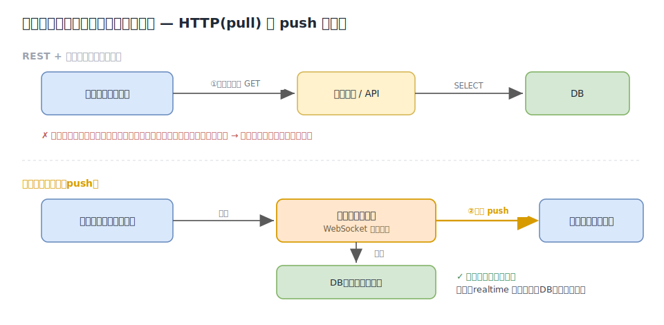
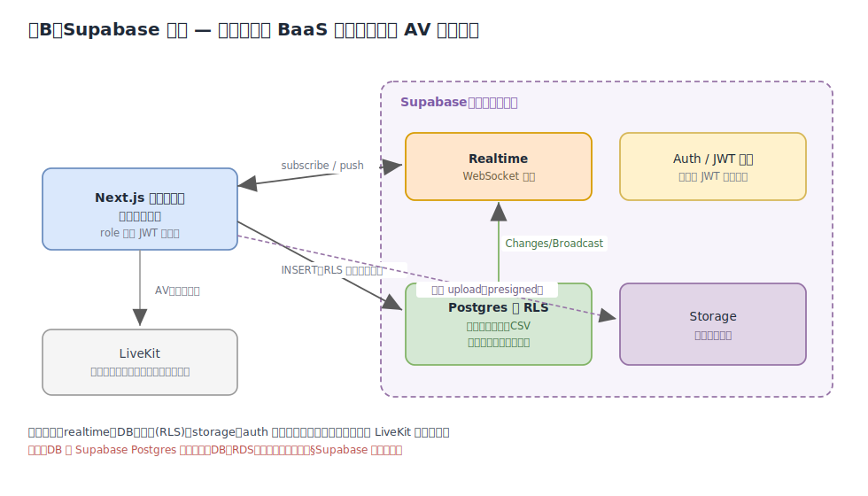
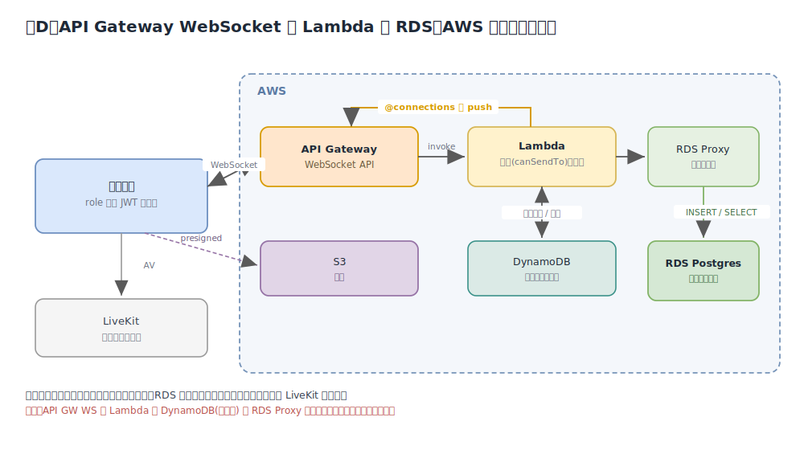
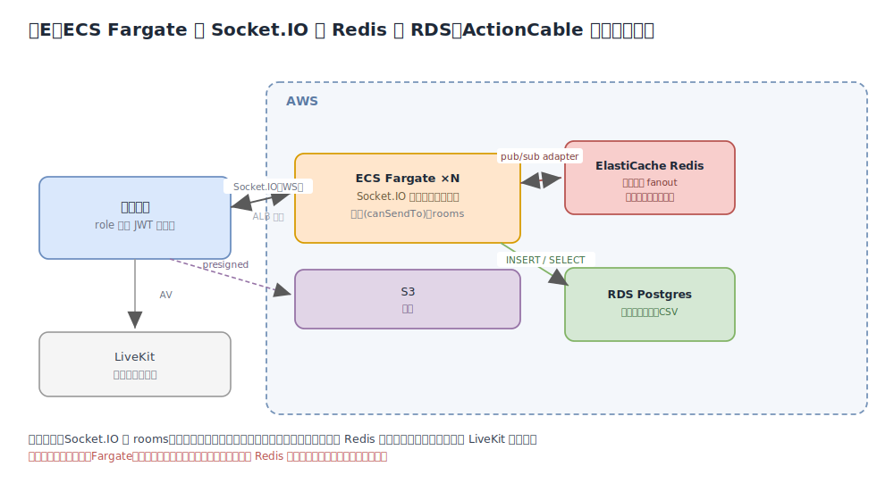
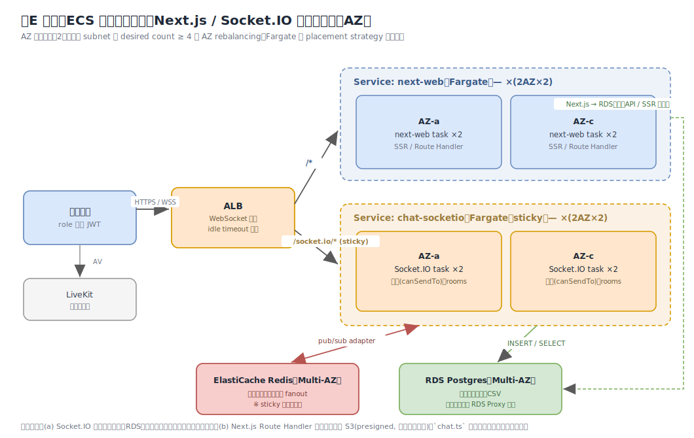

# 実査チャット リアルタイム層 アーキテクチャ比較

| 項目 | 内容 |
|---|---|
| 対象 | 独立 Next.js 実査アプリ（Rails / ActionCable を使わない）のチャット基盤 |
| 関連 | `machamp0714/livekit-poc#4`（チャット PoC）／親 `minedia/minedia-www#5317`（実査機能の外だし） |
| 作成日 | 2026-06-15 |
| 前提 | DB は **AWS RDS（PostgreSQL）** を採用。チャットは AV ベンダー（LiveKit）から分離する方針。 |
| 目的 | リアルタイム配信層の候補（**Supabase / 案D / 案E**）を、図・メリット・デメリット・運用コスト・実装容易性で比較し、採用判断のインプットにする。 |

> 関連ドキュメント: PoC 所見は [`../CHAT_POC_FINDINGS.md`](../CHAT_POC_FINDINGS.md)。本書はその §4（構成案）を図付きで深掘りしたもの。

---

## 1. 背景：なぜ「リアルタイム層」が必要なのか

チャットの本質は「**他の参加者が送ったメッセージを、こちらが要求していなくても受け取る**」こと。これは通常の HTTP（クライアントから要求して初めて応答が返る = pull）では実現できず、サーバーからクライアントへ能動的に届ける **push** の経路が要る。これを担うのが「リアルタイム層」（WebSocket などの常時接続）である。



- **REST + ポーリング**は、間隔ぶんの遅延・空振りリクエストの無駄が出て、実査の即時性（モデレーター指示・録画状態通知など）に不足する。
- **永続化（DB）とリアルタイム層は役割が別**。DB は「記録・履歴・CSV」、リアルタイム層は「今この瞬間の配信」。両方が要る。

### 1-1. 本検討で確定している前提

PoC 所見（[`../CHAT_POC_FINDINGS.md`](../CHAT_POC_FINDINGS.md)）より、独立アプリのチャットが満たすべき能力と、その実現手段は以下に固まっている。**残る論点はリアルタイム配信層（①）の選択のみ**。

| 能力 | 本検討での実現手段 |
|---|---|
| ① リアルタイム配信 | **← 本書で比較（Supabase / 案D / 案E）** |
| ② 永続化・履歴・CSV | RDS（PostgreSQL）※ Supabase 採用時のみ Supabase Postgres |
| ③ ロール別チャネル送信権限の**サーバー強制** | バックエンドで `canSendTo()` 判定（PoC の `lib/livekit/chat.ts` を移植）。Supabase は RLS |
| ④ 添付の保存 | S3（presigned URL）※ Supabase 採用時のみ Supabase Storage |
| AV（映像・音声） | LiveKit。**チャットとは分離** |

> いずれの案も **サーバー権威型**（クライアントが直接ピアに送らず、必ずバックエンドが認可・永続化してから配信）。これは PoC で残課題だった「クライアントによる宛先詐称」を解消するための前提でもある。

---

## 2. 案B：Supabase 採用（マネージド BaaS）



Supabase（Postgres + Realtime + RLS + Storage + Auth）にチャットを集約し、LiveKit は映像・音声のみに使う。現行が ActionCable で実現していた「チャット＝AV 非依存」を、Rails 無しで最も素直に継承する形。

| 観点 | 評価 |
|---|---|
| **メリット** | ・realtime / DB / 認可(RLS) / storage / auth が**単一基盤に集約**され、実装が最速<br>・**RLS** でロール別チャネル送受信を DB レベルに宣言的に強制（サーバーコード最小。PoC の送受信マトリクスを RLS ポリシーへ移植）<br>・WebSocket 接続管理・スケールを Supabase が吸収（運用ほぼ不要）<br>・チャットが LiveKit に非依存 |
| **デメリット** | ・**「DB＝RDS」方針と衝突**（下記の注記）<br>・新規ベンダー依存・ベンダーロックイン（Realtime / RLS は Supabase 固有 API）<br>・マネージド利用時はデータ所在／コンプラ要確認（実査＝個人情報の可能性）<br>・RLS 設計の学習コスト |
| **運用コスト** | 低。マネージド従量課金（接続数・DB サイズ・帯域）。インフラ運用工数はほぼゼロ |
| **実装容易性** | ◎ 最速。SDK が realtime + DB + auth を一気通貫で提供 |

> **⚠️ RDS との整合（重要）**：Supabase 採用は実質「チャットの DB は Supabase Postgres」を意味し、確定済みの「DB＝RDS」と両立しない。両立させるなら 2 択：
> - **(a) Supabase に寄せて RDS をやめる** … Supabase の利点を最大化。ただし「DB＝RDS」方針の見直しが必要。
> - **(b) RDS を正とし、Supabase は Realtime(Broadcast) のみ transport として使う** … RDS 資産を活かすが、DB とリアルタイムが二重管理になり RLS の旨味も半減。
>
> 「DB＝RDS」を堅持するなら、実質的な候補は次の **案D / 案E** になる。

---

## 3. 案D：API Gateway WebSocket + Lambda + RDS（AWS サーバーレス）



AWS ネイティブのサーバーレス構成。API Gateway の WebSocket API で接続を保持し、Lambda が認可・永続化・配信を担う。接続レジストリは DynamoDB、RDS は Lambda からの接続枯渇を防ぐため RDS Proxy 経由。

| 観点 | 評価 |
|---|---|
| **メリット** | ・**フルマネージド・サーバーレス**（常駐プロセス無し、自動スケール）<br>・AWS ネイティブで **RDS をそのまま正に**使える（「DB＝RDS」と整合 ◎）<br>・チャットが LiveKit 非依存<br>・使った分だけ課金（アイドル時はほぼ無料） |
| **デメリット** | ・**部品が多い**（API GW WS＋Lambda 各ルート＋DynamoDB 接続表＋RDS Proxy）。初期構築・学習コスト高<br>・room / presence や fan-out ロジックを自前実装（Socket.IO のような既製機能なし）<br>・Lambda コールドスタート、`@connections` のスロットリング考慮<br>・RDS Proxy の追加コスト |
| **運用コスト** | 中。マネージドだが構成要素が分散しモニタリング対象が多い。従量課金（接続時間・メッセージ数・Lambda・DynamoDB・RDS・RDS Proxy） |
| **実装容易性** | △ 部品結線が多く初期実装は重い。IaC（CDK / Terraform）前提 |

---

## 4. 案E：ECS Fargate + Socket.IO + Redis + RDS（ActionCable に最も近い）



常駐 Node プロセス（ECS Fargate）が Socket.IO で WebSocket 接続を保持する構成。Rails の ActionCable（常駐＋Redis pub/sub）と思想がほぼ同じで、移植イメージが明快。

| 観点 | 評価 |
|---|---|
| **メリット** | ・**ActionCable に最も近い**（常駐＋Redis pub/sub）。設計・移植イメージが明快<br>・Socket.IO の **room / namespace / 自動再接続 / ack** が既製。**room = チャネルで受信認可が自然**に表現できる<br>・**単一インスタンスなら Redis 不要**で小さく開始でき、スケール時に追加<br>・RDS を正に使える（「DB＝RDS」と整合 ◎）<br>・チャットが LiveKit 非依存。ベンダーロックインが低い（Socket.IO は OSS） |
| **デメリット** | ・**常駐プロセス（Fargate）＝アイドルでも固定費**<br>・水平スケールに ElastiCache(Redis) と、デプロイ時の接続断（ローリング）対策が必要<br>・Next.js をサーバーレスにデプロイする場合、チャットだけ別サービス（Fargate）に分離する構成管理<br>・コンテナ／オートスケール／Redis の運用を自前で保有 |
| **運用コスト** | 中。常時稼働の Fargate（最低 1〜2 タスク）＋（スケール時）ElastiCache の固定費。運用工数はコンテナ運用の標準的な範囲 |
| **実装容易性** | ○ Socket.IO によりアプリ実装は最も素直。インフラ（Fargate / Redis）構築は中程度 |

#### ECS デプロイ詳細（Next.js / Socket.IO をサービス分離・マルチAZ）

本番では **Next.js と Socket.IO を別サービス**にする（1 タスクに同梱しない）。スケール軸（SSR は CPU/RPS、WS は接続数/メモリ）とデプロイを独立させ、アプリのデプロイで WS 接続を切らないため。



- **AZ ごとに最低2台**：Fargate は placement strategy 不可。複数 subnet ＋ desired count ≥ 4 ＋ AZ rebalancing で分散。
- **ALB**：パスベースで `/socket.io/*` → chat-socketio、`/*` → next-web。WebSocket 有効・idle timeout 調整。
- **chat-socketio に必須**：① **sticky session**（long-polling ハンドシェイクの張り付き。`transports:['websocket']` なら不要）、② **Redis アダプタ**（タスク間 fan-out。sticky とは別問題）、③ graceful shutdown ＋ deregistration delay（デプロイ時の接続断対策、クライアントは自動再接続）。
- **RDS**：常駐プロセスはコネクションプールが安定するため **RDS Proxy が原則不要**（案D との差）。
- **送信経路**：(a) Socket.IO に集約（認可＋RDS保存＋配信）＝低レイテンシで推奨／(b) Next.js Route Handler 経由。`lib/livekit/chat.ts` の認可は共有パッケージ化してどちらでも再利用。

---

## 5. 横断比較

| 観点 | 案B Supabase | 案D API GW WS | 案E Fargate+Socket.IO |
|---|---|---|---|
| リアルタイム方式 | Supabase Realtime | API GW WebSocket | Socket.IO（WS） |
| 永続化（DB） | Supabase Postgres | **RDS** | **RDS** |
| 認可方式 | RLS（DB） | Lambda + JWT | Socket.IO middleware + JWT |
| 添付 | Supabase Storage | S3 | S3 |
| AV からの独立 | ◎ | ◎ | ◎ |
| 新規インフラ | Supabase 1 つ | API GW＋Lambda＋DynamoDB＋RDS Proxy | Fargate（＋Redis） |
| 運用コスト（固定費） | 低（従量・低アイドル） | 低（従量・低アイドル） | 中（常駐の固定費あり） |
| スケール | 自動（Supabase 任せ） | 自動 | 要設計（Redis） |
| 実装容易性 | ◎ | △ | ○ |
| ベンダーロックイン | 高（Supabase） | 中（AWS） | 低（OSS） |
| **「DB＝RDS」との整合** | ✗ 要方針変更 | ◎ | ◎ |
| **ローカル検証のしやすさ**（→ §7） | ○ Supabase CLI 一発・要 Docker | △ WS エミュ不完全 | ◎ 既存 compose 流用・local ≈ prod |

### 参考：案A（LiveKit データチャネル再利用）

別系統として、リアルタイム配信に新インフラを足さず **LiveKit のデータチャネルを再利用**する案もある（Route Handler が `RoomServiceClient.sendData()` で配信、永続化は RDS）。追加インフラ最小・`chat.ts` をサーバー流用できる利点があるが、**チャットが LiveKit に再結合**し AV からの独立を失う。詳細は [`../CHAT_POC_FINDINGS.md` §4](../CHAT_POC_FINDINGS.md)。

---

## 6. 推奨と判断ポイント

判断は「**DB＝RDS を堅持するか**」と「**常駐インフラを許容できるか**」の 2 軸でほぼ決まる。

- **DB＝RDS を堅持（確定方針どおり）＋ 構成の複雑さを避けたい** → **案E（Fargate + Socket.IO、単一インスタンスから開始）**
  - ActionCable に最も近く移植が容易、受信認可が room で自然、小さく始めてスケール時に Redis を足せる。常駐の固定費が許容できるならバランスが良い。
- **DB＝RDS を堅持＋常駐を避けてサーバーレスにしたい** → **案D（API Gateway WebSocket）**
  - ただし部品が多く初期構築コストが高い（複雑さ回避を優先するなら順位は下がる）。
- **実装最速・運用最小を最優先し、DB を Supabase に寄せる方針変更を許容できる** → **案B（Supabase）**
  - 「DB＝RDS」と両立しない点が唯一にして最大の論点。

> 現時点の制約（**DB＝RDS・複雑さ回避・AV からの独立を維持**）に最も合致するのは **案E**。Supabase は「DB＝RDS」方針を見直せる場合に最速の選択肢として再浮上する。

---

## 7. ローカルでの動作検証

### 7-0. 既存のローカル土台（`compose.yaml`）を流用する

本リポジトリの `compose.yaml` には、そのままチャット検証に使えるサービスが揃っている。各案はこれを土台にし、足りないものだけ足す。

| 既存サービス | ポート | チャット検証での用途 |
|---|---|---|
| MinIO（S3 互換） | `:9000`（コンソール `:9001`） | **添付の S3 代替**（案D / 案E）。バケット `livekit-poc-recordings` を自動作成 |
| Redis | `:6379` | **案E の Socket.IO アダプタ**に流用（スケール検証時） |
| LiveKit | `:7880` | **AV（映像・音声）**。全案で不変 |

> 共通で追加が要るのは **PostgreSQL（RDS のローカル代替）** のみ（案D / 案E）。`compose.yaml` に下記を足すのが簡単。
> ```yaml
>   postgres:
>     image: postgres:16-alpine
>     container_name: livekit-poc-postgres
>     environment: { POSTGRES_PASSWORD: postgres, POSTGRES_DB: chat }
>     ports: ["5432:5432"]
> ```

各案とも**検証の基本形は共通**：別ロール（moderator / panelist / observer）の 2〜3 タブを開き、(1) 全体(public) 送受信、(2) private の宛先限定（panelist に届かない）、(3) 送信権限の無いチャネルが拒否される、(4) リロード後に履歴 API から復元、を確認する。

---

### 7-1. 案B：Supabase（ローカル）

**必要なもの**：Docker、Supabase CLI（`brew install supabase/tap/supabase` または `npx supabase`）

```bash
npx supabase init
npx supabase start          # Postgres:54322 / API:54321 / Studio:54323 / Realtime をローカル起動
# messages テーブル + RLS ポリシー（送受信マトリクス）をマイグレーションに記述して適用
npx supabase db reset
```
フロントは `@supabase/supabase-js` を `supabase start` が出力する **ローカル URL + anon key** に向ける。

**検証**：2 タブを別ロールで開き送受信 → realtime で即時表示。**RLS 検証**として権限の無いチャネルへ `insert` を試すと **DB レベルで拒否**されることを確認。行は Studio（`localhost:54323`）で確認、添付は同梱の Storage。

**ローカルの限界**：Supabase ローカルは**実スタックそのもの**なので本番との差がほぼ無い（再現性 ◎）。ただし Docker 必須で、ここで使う DB は Supabase Postgres（= RDS は使わない点が方針と要調整）。

---

### 7-2. 案D：API Gateway WebSocket + Lambda（ローカル）

**必要なもの**：Docker、Serverless Framework + `serverless-offline`（WebSocket 対応）、DynamoDB Local、Postgres、（添付）既存 MinIO

```bash
docker compose up -d minio                      # 添付用 S3（既存）
docker run -p 5432:5432 -e POSTGRES_PASSWORD=postgres postgres:16-alpine   # RDS 代替
docker run -p 8000:8000 amazon/dynamodb-local   # 接続レジストリ
npx serverless offline                          # ws://localhost:3001 で $connect/route/$disconnect と @connections を擬似
```

**検証**：`wscat -c ws://localhost:3001` を 2 つ（または 2 タブ）で接続 → 送信 → `@connections` 擬似配信で相手に届く。Postgres で永続化行、DynamoDB Local で接続レジストリを確認。

**ローカルの限界（重要）**：**3 案で最も再現が難しい**。`serverless-offline` / LocalStack（無償版）は API Gateway v2（WebSocket）を完全再現せず、`@connections` のスループット制限・IAM 認可・RDS Proxy の挙動は擬似されない。より忠実にやるなら LocalStack Pro（有償）。→ 案D の「複雑」というデメリットがローカル検証にも表れる。

---

### 7-3. 案E：ECS Fargate + Socket.IO（ローカル）

**必要なもの**：Node、（既存）Redis `:6379`、Postgres、（添付）既存 MinIO

```bash
docker compose up -d redis minio                # 既存サービスを流用（redis は Socket.IO アダプタに転用）
docker run -p 5432:5432 -e POSTGRES_PASSWORD=postgres postgres:16-alpine   # RDS 代替（compose に足してもよい）
pnpm dev:chat-server                            # Fargate で動かすのと同じ Socket.IO プロセスを ws://localhost:4000 で起動
```

**検証**：2 タブを別ロールで → Socket.IO 接続 → 送信 → **room ベースで配信**され、`canSendTo()` の認可が効くことを確認。Postgres で永続化、リロードで履歴 API から復元。**スケール検証**は、サーバーを 2 プロセス（`:4000` / `:4001`）起動して既存 Redis をアダプタに繋ぎ、別プロセスのクライアント間でも配信されることを確認する。

**ローカルの限界**：**ローカル ≒ 本番**（Fargate は同じコンテナ／プロセスを動かすだけ）。ALB のスティッキーセッションはローカルに無いが機能検証には不要。→ 案E の「動かしやすさ」がローカルでもそのまま出る。

---

### 7-4. まとめ（ローカル検証の観点）

| | 起動の手数 | 本番との一致度 | 備考 |
|---|---|---|---|
| 案B Supabase | 小（`supabase start` 一発） | ◎ 実スタック | 要 Docker。DB は Supabase Postgres |
| 案D API GW WS | 大（WS エミュ＋ DynamoDB ＋ DB） | △ WebSocket 部が不完全 | 忠実化は LocalStack Pro |
| 案E Fargate+Socket.IO | 中（既存 compose ＋ DB ＋ Node） | ◎ local ≈ prod | 既存 MinIO / Redis を流用できる |

ローカル検証のしやすさでも **案E が最も素直**（既存土台の流用が効き、local がほぼ prod）。案D は本番に近い検証ほど難度が上がる。

---

### 付録：図ファイル
- 描画用 SVG: `docs/diagrams/*.svg`（GitHub / VS Code でインライン表示）
- 編集用 drawio: `docs/diagrams/*.drawio`（draw.io / VS Code 拡張 hediet.vscode-drawio で編集可）
